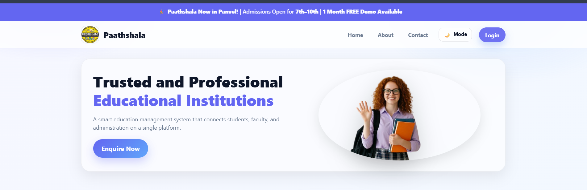
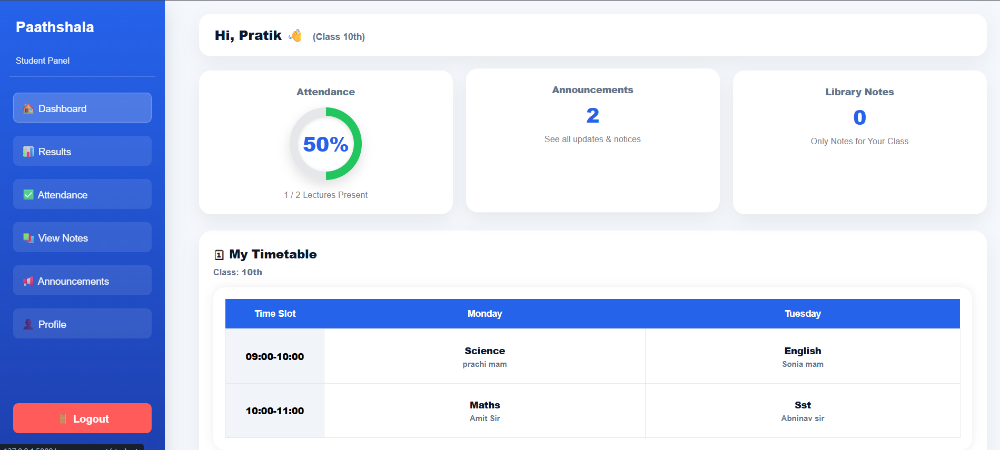
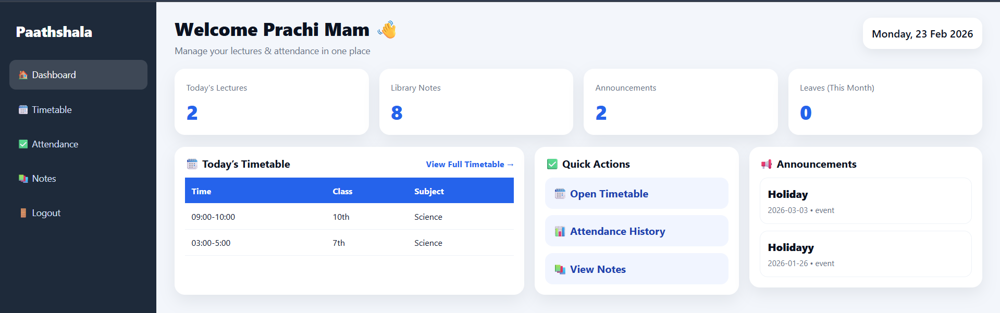
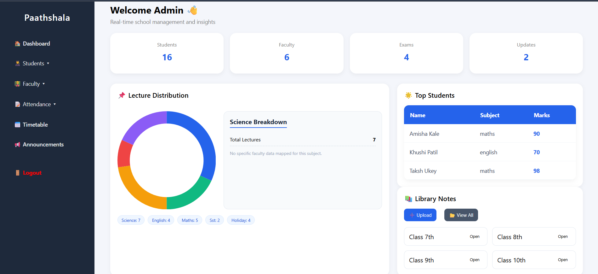

# Paathshala – Education Management System 🎓

## 📌 Project Overview

Paathshala is a **web-based education management system** designed for coaching institutes and educational centers.
It allows administrators, faculty, and students to manage academic activities such as **attendance tracking, announcements, assignments, and student progress** through an interactive dashboard.

The system aims to simplify communication and management between students and faculty using a centralized web platform.

---

## 🎯 Objective

The objective of this project is to create a digital platform where educational institutes can efficiently manage:

* Student information
* Faculty communication
* Attendance records
* Assignments and announcements
* Academic progress tracking

---

## 🛠️ Technologies Used

**Frontend**

* HTML
* CSS
* JavaScript

**Backend**

* Python
* Flask Framework

**Database**

* SQL / SQLite

---

## ✨ Features

### 👩‍🎓 Student Dashboard

* View attendance percentage
* Track academic progress
* View assignments and homework
* Check announcements and exam notifications
* Interactive calendar for events and tests

### 👨‍🏫 Faculty Dashboard

* Upload assignments
* Post announcements
* Manage student data
* Monitor attendance

### 🛠 Admin Controls

* Manage student and faculty accounts
* Control system data
* Maintain database records

---

## 📷 Project Screenshots

### Home Page

### Student Dashboard

### Faculty Dashboard

### Admin Dashboard

---

## 📂 Project Structure

paathshala-education-management-system
│
├── app.py
├── requirements.txt
├── README.md
│
├── templates
│   ├── index.html
│   ├── login.html
│   ├── student_dashboard.html
│   ├── faculty_dashboard.html
│
├── static
│   ├── css
│   ├── js
│   └── images
│
├── database
│   └── schema.sql

---

## 🚀 Future Improvements

* Online test and quiz system
* Real-time notifications for announcements
* Mobile responsive interface
* Integration with learning management tools
* Data analytics for student performance

---

## 👩‍💻 Author

**Amisha Kale**
BSc Computer Science Student

---

## ⭐ Support

If you like this project, consider **starring the repository** on GitHub.
